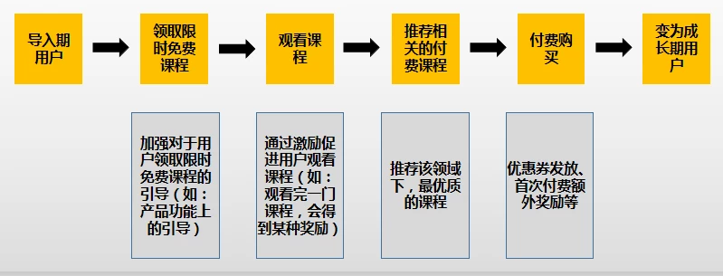

# 用户生命周期管理

## **导入期 -&gt; 成熟期**

1. 拉取相关数据，通过数据分析找到发力点，思考以下几个问题
   * 从导入期的用户变为成长期和成熟期用户中，他们普遍发生过什么行为？（使用过某项功能？体验过某项服务？发生过某些相似用户行为？等等）
   * 从导入期的用户变为成长期和成熟期用户中，大部分用户符合什么特征？
2. 搭建一条导入期用户变为成长期或成熟期用户最优的成长路径
3. 通过各种运营手段或激励措施，促进该成长路径中每个环节的发生或转化

### 通过数据分析找到发力点

看两部分数据即可：用户基础数据和用户行为数据。

* 用户基础数据可以包含：年龄、性别、地区、职业、爱好等。
* 用户行为数据则需要结合产品业务模式综合思考，针对付费学习类产品来说，可以是：观看免费课程的数量/时长、加入学习社区情况、关注感兴趣的学习领域/知名讲师等等。

> 拿付费学习类产品来说，如果通过数据分析发现：当用户完整的观看了超过3门感兴趣的免费课程时，后续付费学习的概率会有显著的提升。这就是一条非常有用的数据线索，可以根据这条线索去搭建一条优质的用户成长路径。

###  **搭建一条优质的用户成长路径**

通过数据分析，一条优质的用户成长路径可能如下，其中每个环节可以通过各种运营手段或激励措施，促进发生或转化

##  **延长用户的有效生命周期**

### 定义流失用户

流失用户的定义需要关注两个维度的事情：一是多长时间，二是发生的用户行为。比如：将超过30天都未登录APP的用户，定义为流失用户。流失用户的定义，需根据产品业务而定。

### 分析流失征兆

思考这些问题：在用户流失前发生过哪些类似的用户行为？流失用户是否集中于某一渠道？流失用户在性别、年龄、爱好等方面是否类似？用户流失前，产品是否做了较大改动？

最后通过数据分析或用户访谈的方式，找到用户流失的主要原因。

### 设立预警机制

监控数据，进行预流失用户的建模。结合用户流失的原因，将预流失用户定义或标记出来。比如：注册超过15天，还没有领取并观看免费课程的用户，标记为预流失用户

### 用户干预和引导

根据用户流失的原因，分别对用户进行干预和引导。比如针对没有领取并观看免费课程的预流失用户，可通过福利刺激的方式（比如：观看课程后，可获得优惠券等），让用户完成相应的行为。

